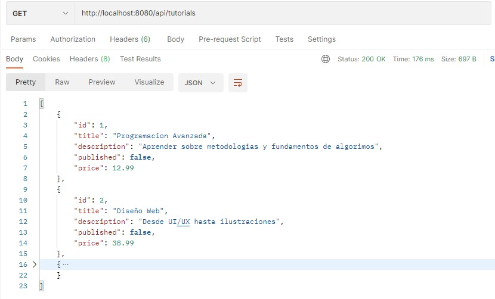
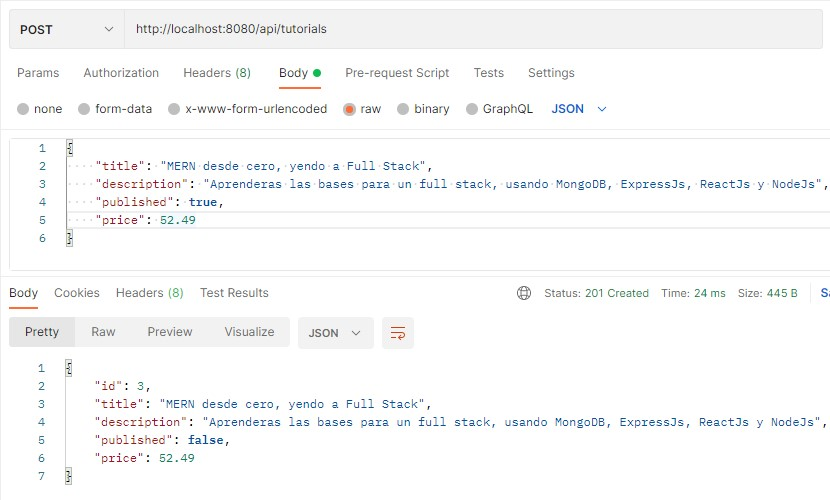
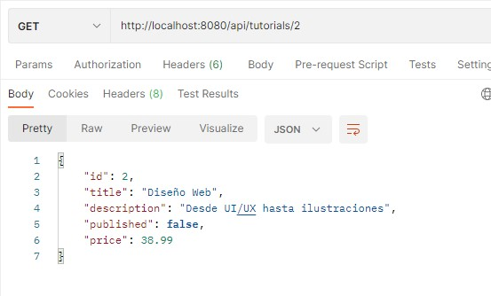
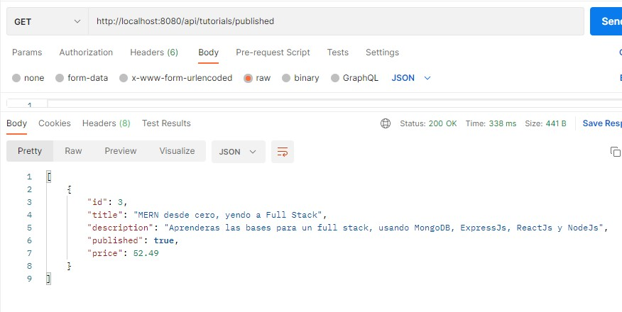
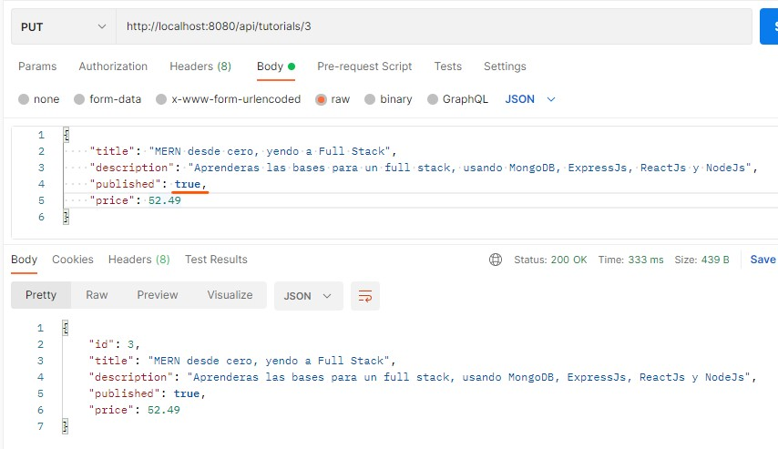
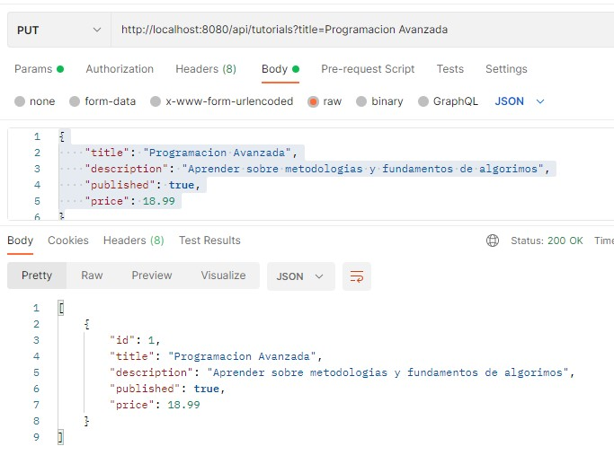
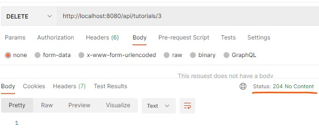
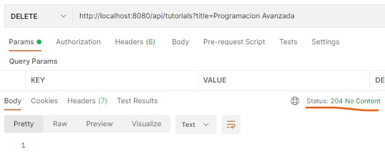
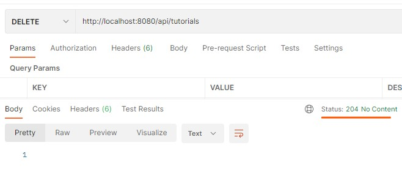

# springboot-server

Esto es una aplicación de ejemplo que provee una API REST de tutoriales.

La API es un proyecto creado en Java utilizando Springboot como framework.

## Ejecutar la app

    mvnw.cmd spring-boot:run

# API REST

La API REST de la aplicación se explica a continuación

| METODO HTTP | POST            | GET         | PUT         | DELETE |
| ----------- | --------------- | ----------- | ----------- | ------ |
| CRUD OP     | CREATE          | READ        | UPDATE      | DELETE |
| /tutorials       | Crear nuevo tutorial | Listar tutoriales   | Error | Eliminar todos los tutoriales |
| /tutorials/1  | Error           | Mostrar tutorial    | Si existe, modificar tutorial; Si no, error | Eliminar tutorial |
| /tutorials/1/price  | Error           | Mostrar precio del tutorial     | Error | Error |
| /tutorials/published  | Error           | Listar tutoriales publicados    | Error | Error |
| /tutorials?title=abc  | Error           | Error     | Modificar tutoriales cuyo titulo coincida | Eliminar tutoriales cuyo titulo coincida |

## Obtener listado de tutoriales

`GET /tutorials`

## Crear nuevo tutorial

`POST /tutorials`

## Obtener tutorial mediante ID

`GET /tutorials/{id}`

## Obtener tutorial publicados

`GET /tutorials/published`

## Obtener precio de tutoriales mediante ID

`GET /tutorials/{id}/price`

## Modificar un tutorial mediante ID

`PUT /tutorials/{id}`

## Modificar un tutorial mediante titulo

`PUT /tutorials?title=`

## Eliminar un tutorial mediante ID

`DELETE /tutorials/{id}`

    
## Eliminar un tutorial mediante titulo

`DELETE /tutorials?title=`

## Eliminar todos los tutoriales

`DELETE /tutorials`

